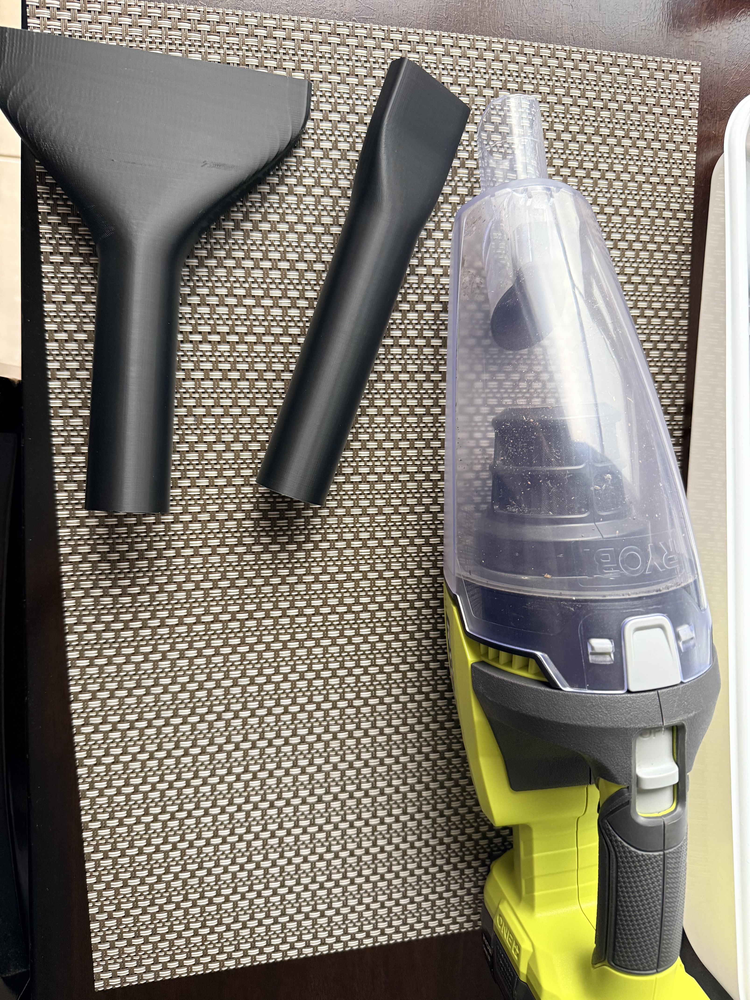
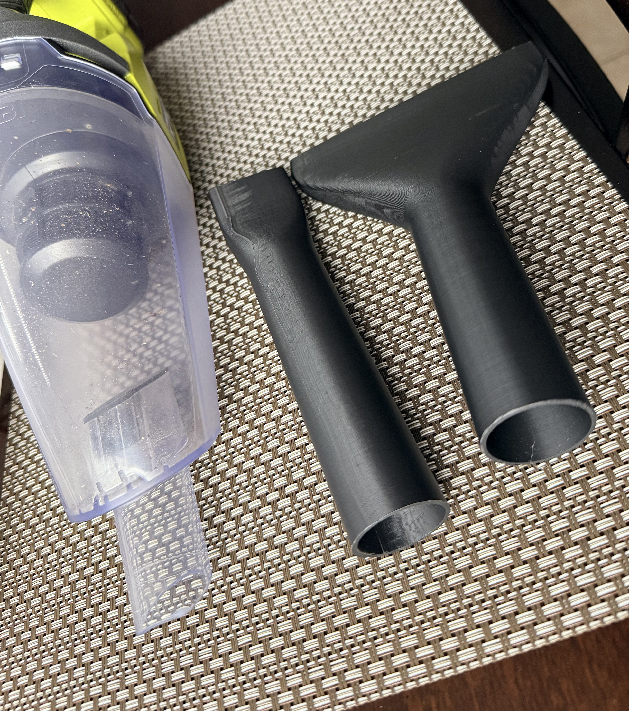
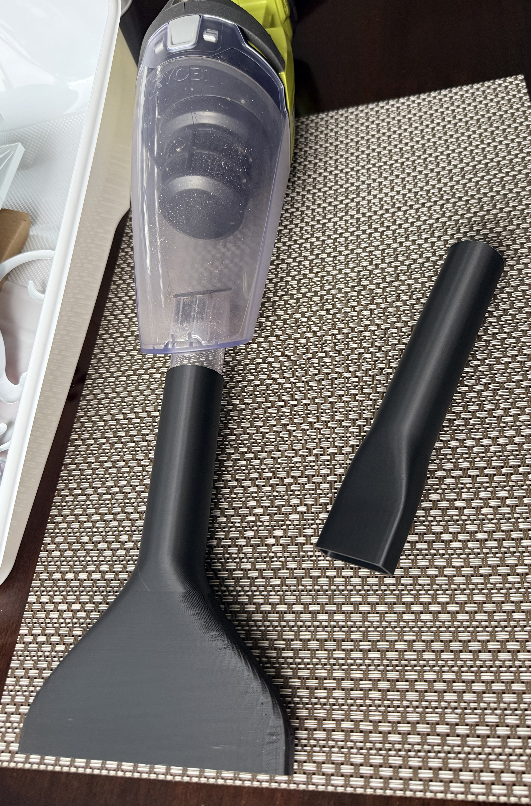

# PCL705 Vacuum Extension Tube

> 3D printed extension tubes and nozzles for the **PCL705** (Home Depot's green brand) cordless vacuum.

---

## What’s included

This repository contains the STL/3MF files for accessories designed to extend the reach and versatility of the PCL705 vacuum:

- **`PCL705-crevice-200mm`** — a 200 mm narrow crevice tool for tight gaps and corners.  
  Files: `PCL705-crevice-200mm.stl` and `PCL705-crevice-200mm.3mf`
- **`PCL705-wide-nozzle`** — a wide-mouth nozzle for larger surfaces and faster cleanup.  
  Files: `PCL705-wide-nozzle.stl` and `PCL705-wide-nozzle.3mf`
- **`PCL705Ryobi+Vacuum+Extender+V2`** — the extender adapter that connects the accessories to the PCL705 vacuum hose/wand.  
  File: `PCL705Ryobi+Vacuum+Extender+V2.3mf`

All parts are designed to be printed without supports and snap/fit onto the existing PCL705 vacuum wand.

---

## Credits / Inspiration

These accessories are inspired by the public model **“Ryobi PCL705 Vacuum Extension Tube”** by **[@dpappo](https://makerworld.com/en/@dpappo)** on MakerWorld.

- Original model: https://makerworld.com/en/models/3004740-ryobi-pcl705-vacuum-extension-tube#profileId-3373957
- Creator profile: https://makerworld.com/en/@dpappo

This repository contains remixes/adaptations of that original design for the PCL705 vacuum.

---

## Gallery — 3D printed parts

| 3D printed accessory | 3D printed accessory | Accessories in use |
| --- | --- | --- |
|  |  |  |

---

## Print settings

| Setting | Recommendation |
| --- | --- |
| Material | PETG or PLA+ (PETG preferred for durability) |
| Layer height | 0.2 mm |
| Infill | 20–25% |
| Walls | 3+ |
| Supports | Not required for most orientations |
| Orientation | Print as oriented in the 3MF files; otherwise flat side down |

---

## Usage

1. Download the desired STL or open the 3MF project in your slicer.
2. Print using the settings above.
3. Attach the extender to the PCL705 vacuum wand.
4. Slide on the crevice tool or wide nozzle as needed.

---

## License

These models are shared as-is for personal use and modification. Feel free to remix, improve, and share your own variants.

